 

 

---

## // about

Senior engineer who actually reads the diff. 8+ years across 3D engines, reactive backends, and everything in between. I take the hard tickets — fix what's broken, cut what's bloated, build what doesn't exist yet. Legacy code is just undocumented intent.

---

---

## // experience

**Software Engineer** — WickedGames
> Reactive slot engine on Spring WebFlux handling **1000+ concurrent spins** — deterministic replay, 243-ways mechanics, avalanche systems. Full test pyramid: unit → integration → WebTestClient E2E. 15 live games with 1000 requests per minute.

**3D & Frontend** — personal projects
> Browser games, Telegram Mini Apps, custom GLSL shaders. Mini games. Websocket games.

**MCP Tooling**
> Published custom MCP servers for Three.js, PixiJS ECS and internal Vulkan tooling — bringing scene tooling into AI-assisted workflows.

---

 

 

  Novi Sad, Serbia &nbsp;·&nbsp; open to relocation

