<div align="center">
  
</div>

<br/>

```js
const dev = {
  name:       "Dmitriy Golub",
  role:       "Software Engineer",
  experience: "8+ years",
  company:    "WickedGames",
  stack:      ["Three.js", "WebGL/GLSL", "React", "Java/Spring WebFlux", "PixiJS", "Nodejs", "Nestjs"],
  mcp-creator:        ["three.js-mcp", "pixijs-ecs-mcp", "vulkan-internal-mcp"],
};
```

<br/>

---

## // about

Senior engineer who actually reads the diff. 8+ years across 3D engines, reactive backends, and everything in between. I take the hard tickets — fix what's broken, cut what's bloated, build what doesn't exist yet. Legacy code is just undocumented intent.
---

## // stack

<br/>

**3D & Graphics**


**Frontend**


**Backend**


**Tooling**


<br/>

---

## // experience

**Software Engineer** — WickedGame
> Reactive slot engine on Spring WebFlux handling **1000+ concurrent spins** — deterministic replay, 243-ways mechanics, avalanche systems. Full test pyramid: unit → integration → WebTestClient E2E. 15 live games with 1000 request per minute

**3D & Frontend** — personal projects
> Browser games, Telegram Mini Apps, custom GLSL shaders. Mini games. Websockets games.

**MCP Tooling**
> Published custom MCP server for Three.js — bringing 3D scene tooling into AI-assisted workflows.


---

## // connect

<div align="center">

[](https://linkedin.com/in/dmitrii-golub-37950b197)
[](https://t.me/nevrage)

</div>

<br/>

<div align="center">
  <sub>Novi Sad, Serbia &nbsp;·&nbsp; open to relocation</sub>
</div>
